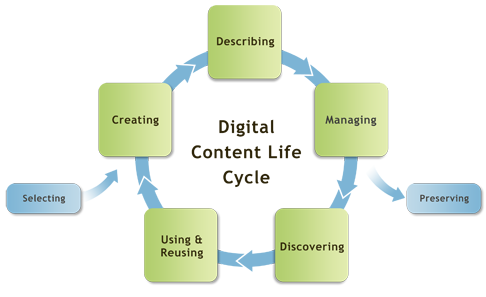

#### Digital preservation is the active management of digital content over time to ensure ongoing access

*Digital Data* by Randall Munroe, <https://xkcd.com/>

**Digital preservation does NOT mean that everything should be digitized**

Instead, digital preservation emphasizes the stewardship of born-digital and digitized objects throughout their lifecycle: 

*Digital Content Life Cycle* by DigitalNZ, <https://blogs.loc.gov/thesignal/2012/02/life-cycle-models-for-digital-stewardship/>

The three keys to creating long-term access to digital objects are:

*	Preserving
*	Curating
*	Maintaining discoverability

*Preservation is a means to provide access for future generations* 

Primary obstacles to the preservation of digital materials:
*	Degradation of object carrier *e.g. vinegar syndrome in microfiche, time and storage conditions affecting hard drives*
*	Restoring to "original" vs. conserving to prevent deterioration *e.g. "correcting" images of physical objects*
*	Format obsoletion *e.g. floppy discs*
*	HTTP Error 404 : Web page not found *e.g. webpages are not constant, URL's are not stable points of access*

