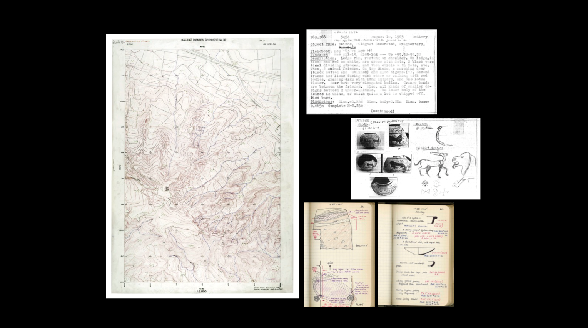
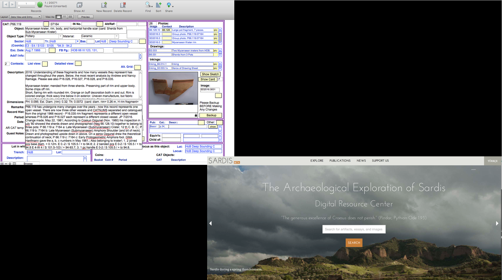
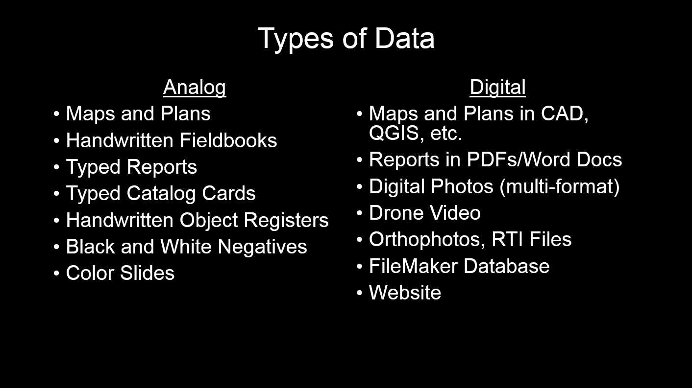
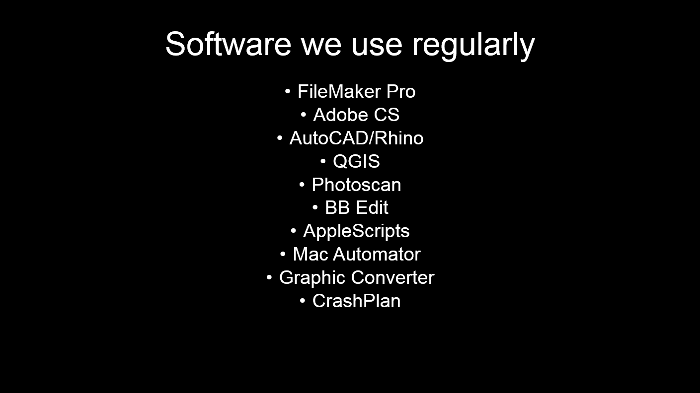
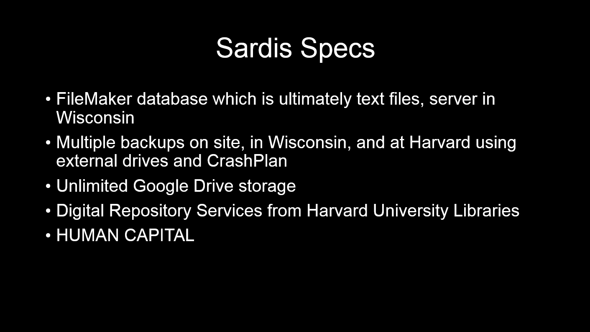
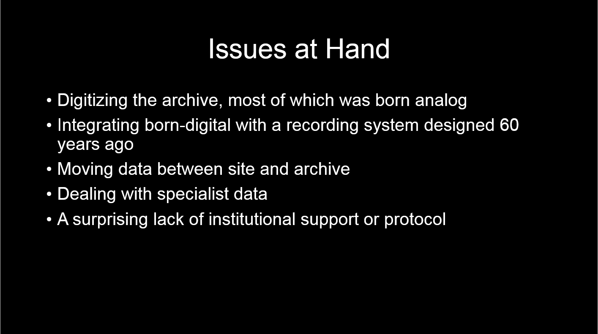

### Theresa Huntsman
#### Harvard Art Museums
#### Publications Data Manager, Sardis Expedition

Check us out at http://www.sardisexpedition.org!

 "**Introduction Slide**"

 "**Second Slide**"

 "**Third Slide**"

 "**Fourth Slide**"

 "**Fifth Slide**"

 "**Sixth Slide**"

 "**Seventh Slide**"

 "**Eighth Slide**"

### Additional resources can be found in the [Resources] tab of this site.
#### A .pdf version of this presentation can be downloaded [here].

[Resources]: https://geokels.github.io/dig-preservation/08-resources/
[here]: https://github.com/geokels/dig-preservation/blob/gh-pages/fig/HuntsmanAIA2018.pdf
