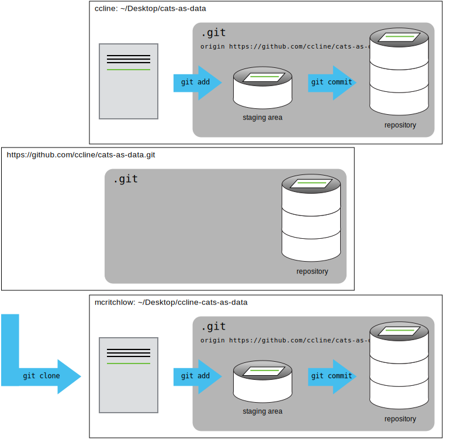

For the next step, get into pairs.  One person will be the "Owner" and the other
will be the "Collaborator". The goal is that the Collaborator add changes into
the Owner's repository. We will switch roles at the end, so both persons will
play Owner and Collaborator.

> ## Practicing By Yourself
>
> If you're working through this lesson on your own, you can carry on by opening
> a second terminal window.
> This window will represent your partner, working on another computer. You
> won't need to give anyone access on GitHub, because both 'partners' are you.
{: .callout}

The Owner needs to give the Collaborator access.
On GitHub, click the settings button on the right,
then select Collaborators, and enter your partner's username.

To accept access to the Owner's repo, the Collaborator
needs to go to [https://github.com/notifications](https://github.com/notifications).
Once there she can accept access to the Owner's repo.

Next, the Collaborator needs to download a copy of the Owner's repository to her
 machine. This is called "cloning a repo". To clone the Owner's repo into
her `Desktop` folder, the Collaborator enters:

~~~
$ git clone https://github.com/ccline/cats-as-data.git ~/Desktop/ccline-cats-as-data
~~~
{: .bash}

Replace `ccline` with the Owner's username. Also note the username prefix on the directory name. This is done because
you already have your own project named `cats-as-data` in the Desktop folder.

The Collaborator can now make a change in her clone of the Owner's repository,
exactly the same way as we've been doing before. Please choose one of the tasks from the cleanup plan created in the Branching lesson.

~~~
$ cd ~/Desktop/ccline-planets
$ cat README.md
~~~
{: .bash}

~~~
...
Cleanup plan:
- Get rid of all caps
- Standardize dates
- Standardize dimensions
~~~
{: .output}

Let's create a branch to do our new work in. Give the branch a representative name for the work you'll be doing.

~~~
$ git checkout -b standardize-dates
~~~
{: .bash}

When you have made your changes, add and commit them.
~~~
$ git add cats-human-situations.csv
$ git commit -m "Standardized all dates"
~~~
{: .bash}

~~~
[standardize-dates 0e61f99] standardized dates
 1 file changed, 4 insertions(+)
 create mode 100644 cats-human-situations.csv
~~~
{: .output}

Then push the change to the Owner's repository on GitHub. Be sure to use the branch name you created.

~~~
$ git push origin standardize-dates
~~~
{: .bash}

~~~
Counting objects: 4, done.
Delta compression using up to 4 threads.
Compressing objects: 100% (2/2), done.
Writing objects: 100% (3/3), 306 bytes, done.
Total 3 (delta 0), reused 0 (delta 0)
To https://github.com/ccline/planets.git
   9272da5..29aba7c  standardize-dates -> standardize-dates
~~~
{: .output}

Note that we didn't have to create a remote called `origin`: Git uses this
name by default when we clone a repository.  (This is why `origin` was a
sensible choice earlier when we were setting up remotes by hand.)

Now the Collaborator should open their browser to the Owner's repository.

We're going to create a [pull request](https://help.github.com/articles/about-pull-requests/).

You should see a highlighted option noting the new branch and an option to *Compare & pull request*

Here you can add additional information to your pull request such as reasoning behind your changes. When you are happy
with the title and description, click on the button to *Create pull request*.

Notice that GitHub will automatically select the branch to merge your pull request into. This is usually `master` and
exactly what you want. However, you can change this to any existing branch in the repository.

The Collaborator's pull request will allow the Owner to:
- review and accept the proposed changes
- perform a merge, just like we did in the Merging branches lesson

The Owner should now review the pull request and [merge](https://help.github.com/articles/merging-a-pull-request/) it.

We recommend using the *Rebase and Merge* option.

Congratulations, you just collaborated on GitHub!

The Owner can now download the Collaborator's changes from GitHub:

~~~
$ git pull origin master
~~~
{: .bash}

~~~
remote: Counting objects: 4, done.
remote: Compressing objects: 100% (2/2), done.
remote: Total 3 (delta 0), reused 3 (delta 0)
Unpacking objects: 100% (3/3), done.
From https://github.com/ccline/cats-as-data
 * branch            master     -> FETCH_HEAD
Updating 9272da5..29aba7c
Fast-forward
 cats-human-situations.csv | 1 +
 1 file changed, 1 insertion(+)
 create mode 100644 cats-human-situations.csv
~~~
{: .output}

Now the three repositories (Owner's local, Collaborator's local, and Owner's on
GitHub) are back in sync.

> ## A Basic Collaborative Workflow
>
> In practice, it is good to be sure that you have an updated version of the
> repository you are collaborating on, so you should `git pull` before making
> our changes. The basic collaborative workflow would be:
>
> * update your local repo with `git pull origin master`,
> * create a branch for making your changes,
> * make your changes and stage them with `git add`,
> * commit your changes with `git commit -m`, and
> * upload the changes to GitHub with `git push origin <branch>`
> * create a pull request
>
> It is better to make many commits with smaller changes rather than
> of one commit with massive changes: small commits are easier to
> read and review.
{: .callout}

> ## Switch Roles and Repeat
>
> Time permitting, switch roles and repeat the whole process.
{: .challenge}

> ## Comment Changes in GitHub
>
> The Collaborator has some questions about one line change made by the Owner and
> has some suggestions to propose.
>
> With GitHub, it is possible to comment the diff of a commit. Over the line of
> code to comment, a blue comment icon appears to open a comment window.
>
> The Collaborator posts its comments and suggestions using GitHub interface.
{: .challenge}

> ## Version History, Backup, and Version Control
>
> Some backup software can keep a history of the versions of your files. They also
> allows you to recover specific versions. How is this functionality different from version control?
> What are some of the benefits of using version control, Git and GitHub?
{: .challenge}
